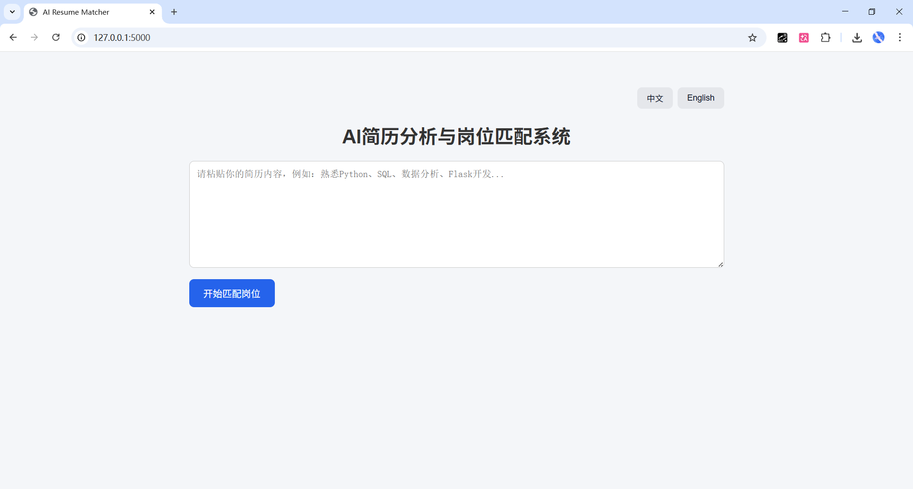
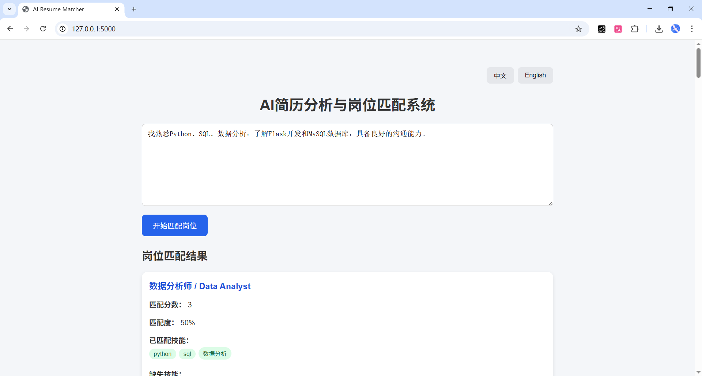
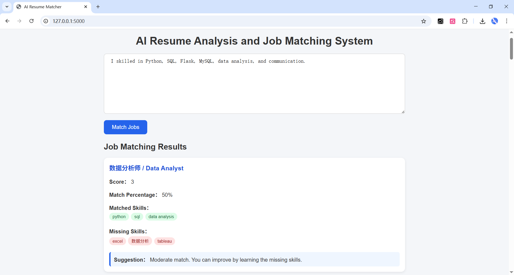

# AI Resume Matcher（简历匹配系统）

这个项目是我发现很多人不知道自己适合什么岗位，那能不能让系统帮忙“看简历 → 给建议”。

于是我做了这个一款用于简历分析和职位匹配的中英文双语系统。
该项目是基于人工智能的求职辅助系统的一部分。
---

## 系统演示

### 中文界面



### 中文匹配结果



### 英文匹配结果



---

## 这个项目是干什么的

用户输入一段简历内容，系统会：

* 给出几个匹配度较高的岗位（比如后端开发 / 数据分析等）
* 标出简历中已经具备的技能
* 提示可能缺失的能力方向
* 给出一个简单的匹配度评分

本质上是一个“简历 → 岗位建议 → 优化方向”的工具。

---

## 一个简单例子

用户输入：

> 熟悉 Python、SQL，有数据分析基础，会用 Flask 做简单项目

系统可能返回：

* Data Analyst（匹配度较高）
* Backend Developer（部分匹配）
* Frontend Developer（匹配较低）

并展示技能匹配情况和改进建议。

---

## 我是怎么实现的

这个项目没有用复杂模型，主要是用规则去做：

* 预先定义岗位数据（存储在 `jobs.json` 中）
* 每个岗位对应一组技能关键词
* 对用户简历文本进行关键词匹配
* 根据命中数量计算匹配度

核心逻辑可以理解为：

匹配度 = 命中技能数量 / 岗位所需技能数量

虽然方法比较基础，但已经可以完整跑通“分析 → 匹配 → 输出”的流程。

---

## 技术部分

* 后端：Python + Flask
* 前端：HTML + JavaScript
* 数据：JSON（岗位与技能）
* 文本处理：关键词匹配

---

## 项目结构

```text
resume-matcher/
├── backend/
│   ├── app.py
│   └── analyzer.py
├── data/
│   └── jobs.json
├── frontend/
│   └── index.html
├── screenshots/
│   ├── home-zh.png
│   ├── result-zh.png
│   └── result-en.png
├── requirements.txt
└── README.md
```

---

## 运行方式

```bash
pip install flask
python backend/app.py
```

浏览器打开：

http://127.0.0.1:5000

---

## 已实现功能

* 简历文本输入
* 岗位匹配结果展示
* 技能匹配提示
* 简单匹配度评分
* 中英文界面切换

---

## 可以继续改进的地方

这个项目还有一些可以优化的方向：

* 使用更好的文本相似度方法（而不是简单关键词）
* 引入向量模型或 embedding
* 扩展更多岗位和技能数据
* 提供更详细的推荐理由
* 支持上传 PDF 简历

---

## 一点总结

这个项目更像是一个“起点”。

它让我把一个完整流程走了一遍：
从输入 → 处理 → 输出结果 → 前端展示。
